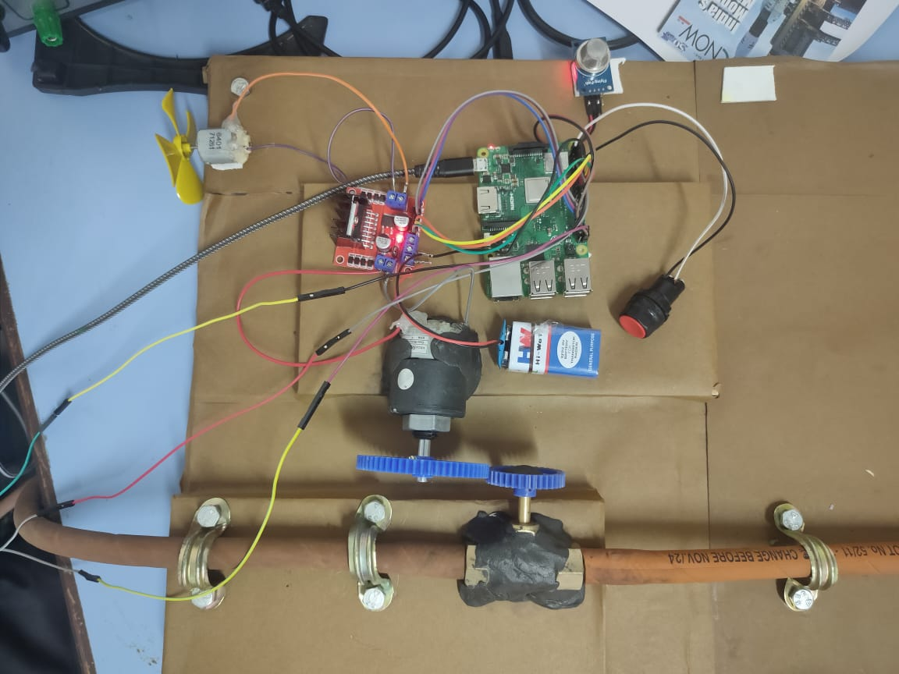
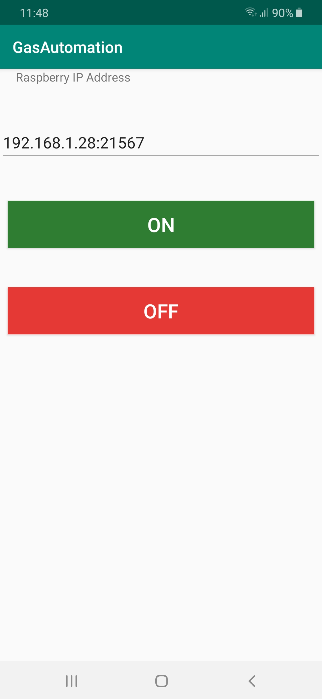

# Gas_Automation_System_IOT
IOT project to control the gas system in raspberry pie using python and android

To establish a communication between android app and raspberry pie
i have used socket class where android app is client and rpi is server and they are connected using ip address.

